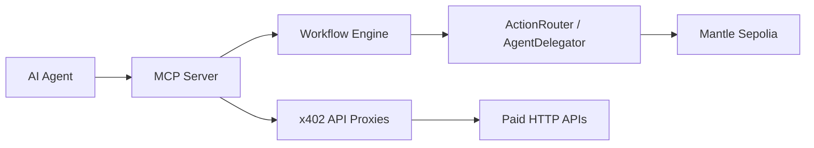

# mani

**Agents with limits.**

mani is an agent-native x402 execution fabric on **Mantle Sepolia**. It lets people publish paid APIs, compose workflows, and let AI agents act through scoped permissions instead of raw private keys.

## What mani does

- Publishes pay-per-call API proxies
- Exposes reusable workflows that mix HTTP calls and on-chain actions
- Provides an MCP server so AI agents can discover capabilities
- Uses ERC-7702 / session keys so agents can act with bounded authority
- Settles x402 payments in MNT on Mantle Sepolia

## Current deployment

The live contract deployment used by this repo is on Mantle Sepolia.

- `AgentDelegator`
  - Address: `0x3A9AB777B438d78059D1735c3ec30e6c94Ea35a1`
  - Source: [hardhat/ignition/deployments/chain-5003/deployed_addresses.json](/C:/Users/XPS/mani/hardhat/ignition/deployments/chain-5003/deployed_addresses.json)
  - Sourcify: https://sourcify.dev/server/repo-ui/5003/0x3A9AB777B438d78059D1735c3ec30e6c94Ea35a1

- `ActionRouter`
  - Address: `0x288dA822f469B9e11818dB9fA6EC74e57230342a`
  - Source: [hardhat/ignition/deployments/chain-5003/deployed_addresses.json](/C:/Users/XPS/mani/hardhat/ignition/deployments/chain-5003/deployed_addresses.json)
  - Sourcify: https://sourcify.dev/server/repo-ui/5003/0x288dA822f469B9e11818dB9fA6EC74e57230342a

Verification status:

- Source verification has been completed for both live Mantle Sepolia contracts via Sourcify.
- Mantle Explorer verification is wired into Hardhat and can be run by setting `MANTLE_SEPOLIA_EXPLORER_API_KEY`.

## AI-powered on-chain actions

At least one AI-controlled function is callable on-chain:

- `grantSession(...)` on `AgentDelegator`
- `executeWithSession(...)` on `AgentDelegator` / `ActionRouter`

Those flows let an agent create scoped session permissions and execute approved actions on-chain without access to the owner key.

## Architecture



### Components

- `apps/web` - public frontend, dashboard, API proxy editor, workflow builder
- `apps/mcp-server` - MCP server for agent discovery and tool execution
- `apps/facilitator` - standalone x402 facilitator service
- `hardhat` - contracts, deployment scripts, and verification
- `packages/contracts` - contract addresses and ABIs
- `packages/payment` - payment helpers and shared x402 logic

## Technical deployment checklist

- [x] Smart contract deployed on Mantle Sepolia
- [x] On-chain agent functions available (`grantSession`, `executeWithSession`)
- [x] Public contract addresses documented in this repo
- [x] Mantle Sepolia deployment wired into the source
- [ ] Frontend demo publicly accessible at `https://<your-public-web-app-url>`
- [ ] DoraHacks submission includes the deployed contract addresses
- [ ] Demo video uploaded and linked in the submission
- [x] Open-source GitHub repo with setup instructions and architecture overview

## Product checklist for submission

Use these values in your DoraHacks submission:

- Deployment address:
  - `AgentDelegator: 0x3A9AB777B438d78059D1735c3ec30e6c94Ea35a1`
  - `ActionRouter: 0x288dA822f469B9e11818dB9fA6EC74e57230342a`
- Frontend demo URL:
  - `https://<your-public-web-app-url>`
- MCP server URL:
  - `https://<your-public-mcp-url>`
- Facilitator URL:
  - `https://<your-public-facilitator-url>`
- Demo video:
  - `https://<your-demo-video-url>`

## Setup

```bash
pnpm install
```

### Web app

```bash
cp apps/web/.env.example apps/web/.env.local
pnpm --filter web dev
```

### MCP server

```bash
cp apps/mcp-server/.env.example apps/mcp-server/.env
pnpm --filter mcp-server dev
```

### Facilitator

```bash
cp apps/facilitator/.env.example apps/facilitator/.env
pnpm --filter facilitator dev
```

### Contracts

```bash
cd hardhat
pnpm install
HACKATHON_KEY=0x... npx hardhat ignition deploy ignition/modules/ActionRouter.ts --network mantleSepolia
```

## Deployment notes

- The frontend should be deployed to a public URL. Do not use localhost for the final demo.
- The MCP server is meant to run on a public host with `MCP_PUBLIC_URL` set.
- The facilitator can run as a standalone service and should also be public if the web app is using it directly.
- Mantle Sepolia is the active chain for the current repo state.

## Links

- Source repo: this repository
- Hackathon submission: add your DoraHacks link here
- Demo video: add your video link here

